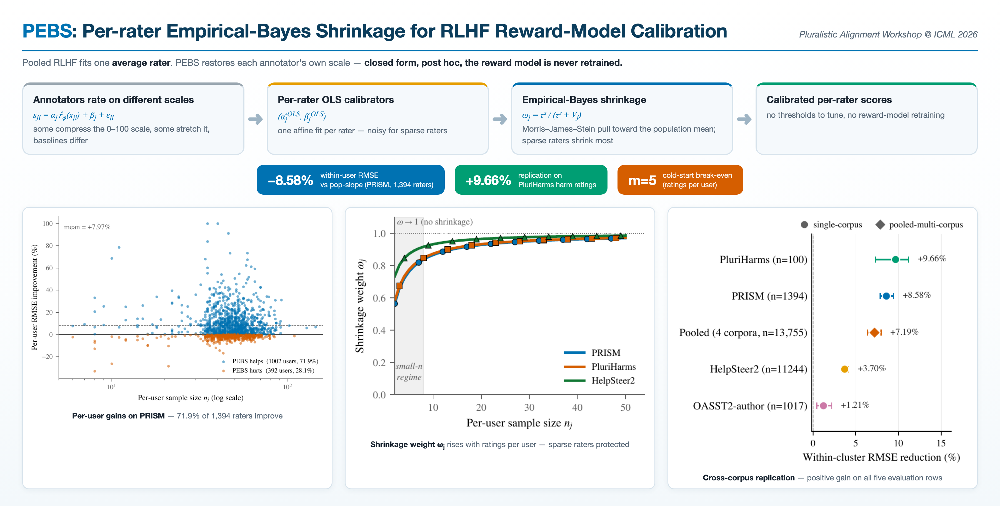

# PEBS: Per-rater Empirical-Bayes Shrinkage for RLHF Reward-Model Calibration

<p align="center">
  
</p>

Code release for the paper **"PEBS: Per-rater Empirical-Bayes Shrinkage for
RLHF Reward-Model Calibration"**, accepted at the **Pluralistic Alignment
Workshop @ ICML 2026** (Seoul, South Korea).

PEBS is a closed-form, post-hoc calibrator for RLHF reward models. It fits a
per-annotator affine calibrator (slope and offset) on each rater's held-out
ratings and applies Morris–James–Stein empirical-Bayes shrinkage toward the
population mean. The base reward model is left unchanged; only the rater-level
map used at inference time is estimated. On PRISM, PEBS reduces within-user
held-out RMSE by 8.58% over the pooled population-slope baseline, and the
procedure replicates on PluriHarms harm ratings (+9.66%).

**Author:** Arnav Raj (Department of Computer Science and Engineering, IIT
Delhi) — `arnav.raj.cs522@cse.iitd.ac.in`

## Repository layout

```
scripts/
├── calibration/      Core method + main evaluations
│   ├── fit_user_calibrators*.py        per-rater OLS fit + EB shrinkage (the PEBS estimator)
│   ├── eval_user_score_mse*.py         within-user RMSE, pop-slope / OLS / shrunk arms (§3.1)
│   ├── eval_user_score_mse_temporal_cv.py  strict temporal 80/20 split (§3.8)
│   ├── eval_pluriharms_pebs*.py        PluriHarms replication, 3 backbones (§3.4, §3.8)
│   ├── eval_helpsteer2_pebs_attribute*.py  HelpSteer2 attribute-as-rater recast (App. B)
│   ├── eval_oasst2_pebs_calibrator.py  OASST2-author replication (§3.4)
│   ├── morris_g_*validate.py           Morris g-function forecaster (§3.7)
│   ├── run_ppo_arm_comparison.py       PPO overoptimization probe (§3.3)
│   └── eval_rewardbench2.py            pair-accuracy invariance check (Prop. 1)
├── q1–q10 (top level) Pre-registered probes mapped to paper sections
│   ├── q1_helpsteer2_replication.py    §3.4 cross-corpus replication
│   ├── q2_f23_mistral_multiseed.py     §3.5 cross-base panel (Mistral)
│   ├── q3_half_pebs_cross_corpus.py    §3.9 intercept-only / slope-only ablation
│   ├── q4_pref_lore_full_embedding.py  App. C PReF / LoRe comparison
│   ├── q5_halpern_plus_pebs_pipeline.py §4 composition with a selection-side method
│   ├── q6_*                            DPO downstream evaluations (§4)
│   ├── q7_backbone_cross_architecture.py §3.5 cross-architecture transfer
│   ├── q9_pooled_4_corpus_pebs.py      §3.4 pooled four-corpus arm
│   └── q10_sample_efficiency_curve.py  §3.9 per-rater sample efficiency
├── wave_a_*           §3.1/§3.8 stability checks (test–retest, cluster bootstrap,
│                      demographic balance)
├── wave_b/            5-seed CV reproduction + leave-one-component-out
│                      decomposition (§3.9)
├── wave_c/            Proposition-1 demonstration + OASST2 replication (§3.4)
├── falsifiers/        F1–F4 pre-registered falsification tests (§3.9)
├── baselines/         LoRe / PReF / P-GenRM re-implementations on PRISM (App. C)
├── cohorts/           dataset preparation (PRISM, PluriHarms, HelpSteer2,
│                      MultiPref, OASST2, SHP)
├── analysis/          post-fit analyses (per-demographic gain, cold-start curve,
│                      LOCO re-analyses, EBPO / LoRe comparisons)
└── plots/             figure generation
```

## Installation

Python 3.10+. CPU is sufficient for all calibration and analysis scripts;
the reward-model fine-tuning, PPO, and DPO scripts need a CUDA GPU.

```bash
pip install -r requirements.txt
```

## Data

PRISM, PluriHarms, HelpSteer2, MultiPref, OASST2, and SHP are not
redistributed here; obtain them from their original sources (citations in
the paper). Cohort-preparation scripts under `scripts/cohorts/` produce the
parquet files the experiments consume.

Scripts accept explicit paths via CLI flags (see `--help` on any script);
defaults can be overridden with `--calibrators-path`, `--rm-scored`,
`--results-dir`, `--output-dir`, and the `HF_HOME` / `PEBS_RESULTS_DIR`
environment variables.

## Reproducing the main results

**Primary experiment — PRISM within-user RMSE (§3.1; ~10 min, CPU):**
```bash
python scripts/calibration/fit_user_calibrators.py \
  --rm-scored /your/path/prism_rm_scored.parquet \
  --output /your/path/prism_user_calibrators.parquet

python scripts/calibration/eval_user_score_mse_shrunk.py \
  --calibrators /your/path/prism_user_calibrators.parquet \
  --rm-scored /your/path/prism_rm_scored.parquet
```

**Cross-corpus replication — PluriHarms (§3.4; ~20 min per backbone):**
```bash
python scripts/calibration/eval_pluriharms_pebs_3backbones.py
```

**Decomposition ablation — intercept-only / slope-only (§3.9; ~1 min, CPU):**
```bash
python scripts/wave_b/wave_b_W_B5_half_pebs.py
```

**Morris g-function forecaster validation (§3.7; CPU):**
```bash
python scripts/calibration/morris_g_2param_extended_validate.py
```

**DPO downstream — multi-seed Mistral (§4; ~3.5 h per seed on one H100):**
```bash
for seed in 20260420 42 123 7777; do
  python scripts/q6_ms3_dpo_multiseed.py --seed $seed \
    --base-model-id mistralai/Mistral-7B-Instruct-v0.3
done
```

**Falsification suite — F1–F4 (§3.9; CPU):**
```bash
python scripts/falsifiers/F1_synthetic_user_recovery.py
python scripts/falsifiers/F2_rm_signal_ablation.py
python scripts/falsifiers/F3_anti_calibrator.py
python scripts/falsifiers/F4_adversarial_user_injection.py
```

## Citation

```bibtex
@inproceedings{raj2026pebs,
  title     = {{PEBS}: Per-rater Empirical-Bayes Shrinkage for {RLHF}
               Reward-Model Calibration},
  author    = {Raj, Arnav},
  booktitle = {Pluralistic Alignment Workshop @ ICML 2026},
  year      = {2026}
}
```

## License

MIT — see [LICENSE](LICENSE).
